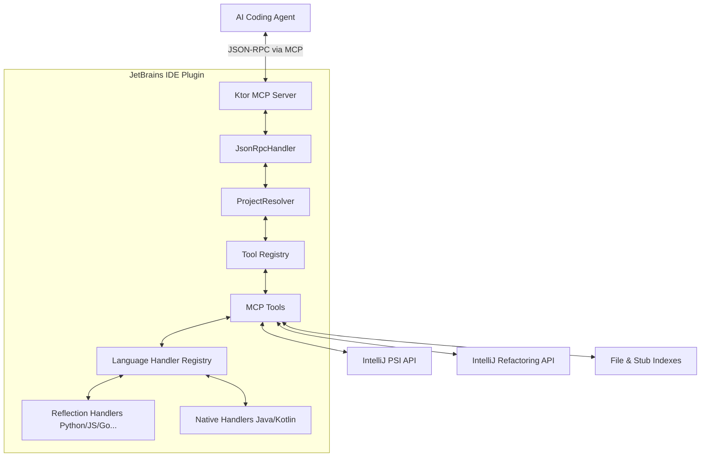

# 1. The Big Picture

The IDE Index MCP Server plugin serves as a bridge between AI coding agents (such as Claude Code, Cursor, and Windsurf) and the vast code intelligence capabilities of JetBrains IDEs.

## The Goal
The primary objective of this plugin is to expose JetBrains IDE features—indexing, code navigation, diagnostics, and refactoring—over the Model Context Protocol (MCP). By doing so, AI agents aren't forced to rely on simple `grep` or text searches. Instead, they can ask the IDE questions like:
- "Where is this method called?" (Call Hierarchy)
- "What are the implementors of this interface?" (Find Implementations)
- "Rename this symbol and automatically update all its references." (Refactoring)

## Core Architecture Overview

At a high level, the plugin operates within the IntelliJ Platform ecosystem. It embeds a standalone HTTP server that listens for MCP requests and translates those requests into IntelliJ Platform API calls.

## Key Interactions

1. **Request Intake**: An AI agent sends a JSON-RPC 2.0 payload to the embedded Ktor server (either via Streamable HTTP or Legacy SSE).
2. **Project Resolution**: The `ProjectResolver` analyzes the payload to determine which open IDE window (and which module) the request is targeting.
3. **Tool Execution**: The `JsonRpcHandler` routes the request to the appropriate tool (e.g., `ide_find_references`). 
4. **VFS/PSI Sync**: Before the tool executes, the system ensures that the Virtual File System (VFS) and the Program Structure Interface (PSI) are synchronized. This guarantees that files modified externally by the AI agent are properly parsed by the IDE before the search begins.
5. **Platform API Call**: The tool invokes the IntelliJ Platform API. For cross-language operations, it delegates to the `LanguageHandlerRegistry`.
6. **Result Streaming**: Results are gathered, often using a cursor-based pagination service to avoid overwhelming the memory with massive result sets, and returned to the agent.

## The Power of the PSI

The cornerstone of the plugin is the JetBrains PSI (Program Structure Interface). Unlike language servers (LSP), the PSI provides a deeply connected, project-wide semantic tree. When the AI agent asks for a symbol definition, the plugin queries the PSI, which can instantly resolve definitions across libraries, modules, and different languages.

This tight integration enables safe refactoring: when the agent calls `ide_refactor_rename`, the plugin utilizes the IDE's built-in `RenameProcessor` to safely alter code, update documentation links, and correct imports.
